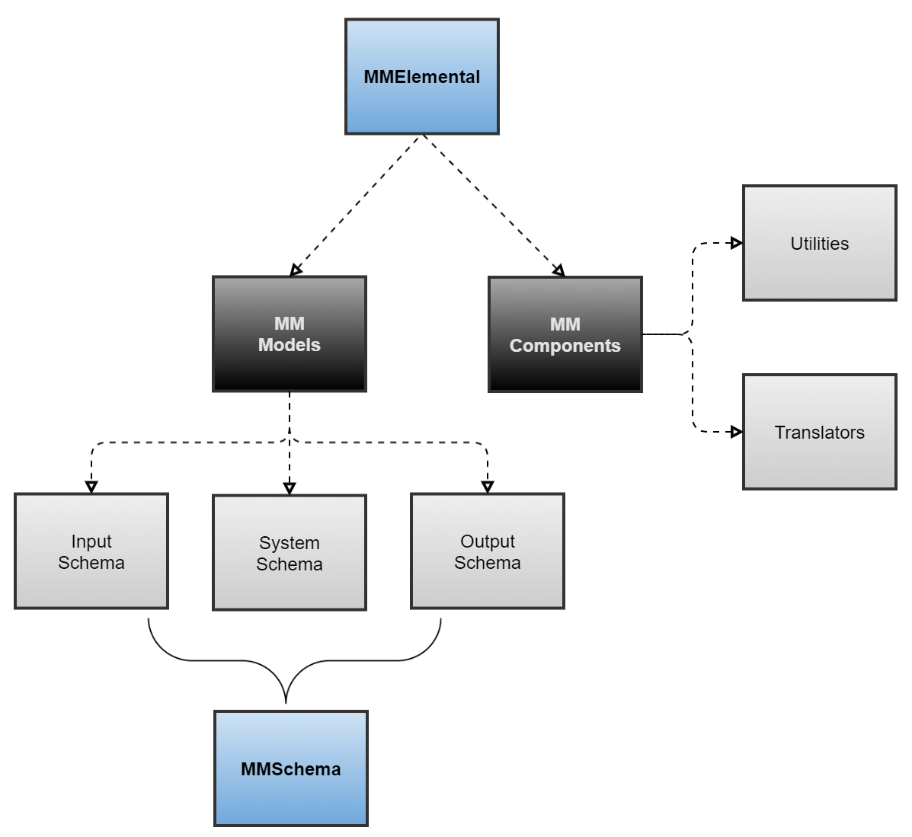

MMElemental
==============================
[//]: # (Badges)

A python package which provides basic models and components for molecular mechanics applications.

### Copyright
Copyright (c) 2021, MolSSI

#### Acknowledgements

Project based on the
[Computational Molecular Science Python Cookiecutter](https://github.com/molssi/cookiecutter-cms) version 1.5.
